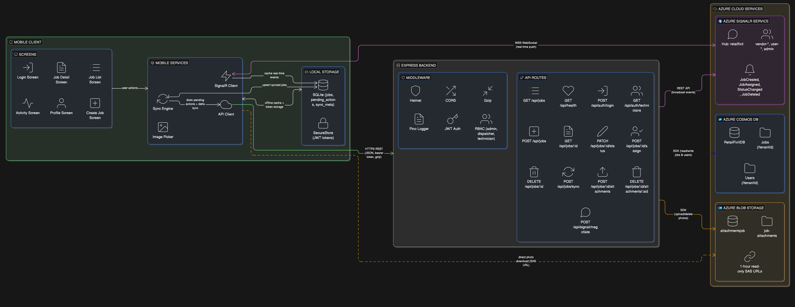

# Part 1: System Design & Architecture

## High-Level Architecture Diagram



## Data Flow Diagrams

### Authentication Flow

```
Mobile                    Backend                  Cosmos DB
  │                         │                         │
  │  POST /api/auth/login   │                         │
  │  {email, password}      │                         │
  │ ───────────────────────>│                         │
  │                         │  findUserByEmail()      │
  │                         │ ───────────────────────>│
  │                         │  <───── user doc ───────│
  │                         │                         │
  │                         │  bcrypt.compare()       │
  │                         │  jwt.sign(payload)      │
  │                         │                         │
  │  <── { token, user } ──│                         │
  │                         │                         │
  │  Store in SecureStore   │                         │
  │  Set API auth header    │                         │
```

### Offline Sync Flow

```
Mobile (SQLite)          Backend                 Cosmos DB
  │                        │                        │
  │  1. Drain pending_actions queue (writes first)  │
  │                        │                        │
  │  POST /api/jobs        │                        │
  │  {title, desc, ...}    │                        │
  │  ──────────────────── >│                        │
  │                        │  createJob()           │
  │                        │  ─────────────────────>│
  │                        │  <── job doc ──────────│
  │  <── 201 Created ─────│                        │
  │  Cache in SQLite       │                        │
  │  Dequeue action        │                        │
  │                        │                        │
  │  PATCH /api/jobs/:id/status                     │
  │  {status, _etag}       │                        │
  │  ──────────────────── >│                        │
  │                        │  eTag check            │
  │                        │  ─────────────────────>│
  │  <── 200 OK ──────────│  <── updated doc ──────│
  │  Cache in SQLite       │                        │
  │  Dequeue action        │                        │
  │                        │                        │
  │  ── OR on 409 ────────│  (eTag mismatch)       │
  │  Mark job 'conflict'   │                        │
  │  Show conflict UI      │                        │
  │                        │                        │
  │  2. Delta sync (reads after writes)             │
  │                        │                        │
  │  POST /api/jobs/sync   │                        │
  │  {since: timestamp}    │                        │
  │  ──────────────────── >│                        │
  │                        │  WHERE updatedAt >     │
  │                        │    since + RBAC filter  │
  │                        │  ─────────────────────>│
  │                        │  <── job docs[] ───────│
  │  <── {data, syncTs} ──│                        │
  │  Upsert (skip pending) │                        │
  │  Update lastSyncTs     │                        │
```

### Real-Time Event Flow

```
Mobile A          Backend            SignalR Service       Mobile B
(Dispatcher)                                              (Technician)
  │                  │                     │                   │
  │ PATCH status     │                     │                   │
  │ ────────────────>│                     │                   │
  │                  │ Update Cosmos DB    │                   │
  │                  │ ···················>│                   │
  │ <── 200 OK ─────│                     │                   │
  │                  │                     │                   │
  │                  │ REST API broadcast  │                   │
  │                  │ sendToGroup(vendor) │                   │
  │                  │ ───────────────────>│                   │
  │                  │ sendToUser(techId)  │  WSS push         │
  │                  │ ───────────────────>│ ─────────────────>│
  │                  │                     │                   │
  │                  │                     │ JobStatusChanged  │
  │                  │                     │ {jobId, status,   │
  │                  │                     │  updatedAt}       │
  │                  │                     │                   │
  │                  │                     │         Upsert to │
  │                  │                     │         SQLite    │
  │                  │                     │         Refresh UI│
```

### Photo Attachment Flow

```
Mobile                    Backend              Blob Storage    Cosmos DB
  │                         │                      │               │
  │ expo-image-picker       │                      │               │
  │ (camera/gallery)        │                      │               │
  │                         │                      │               │
  │ POST /jobs/:id/attach.  │                      │               │
  │ FormData (multipart)    │                      │               │
  │ ───────────────────────>│                      │               │
  │                         │  multer (in-memory)  │               │
  │                         │  validate MIME/size  │               │
  │                         │                      │               │
  │                         │  uploadBlob()        │               │
  │                         │  ───────────────────>│               │
  │                         │  <── success ────────│               │
  │                         │                      │               │
  │                         │  patch(attachments)  │               │
  │                         │  ────────────────────────────────── >│
  │                         │  <── updated doc ───────────────────│
  │                         │                      │               │
  │                         │  generateSasUrl()    │               │
  │                         │  ───────────────────>│               │
  │                         │  <── SAS URL (1hr) ──│               │
  │                         │                      │               │
  │  <── {attachment+URL} ──│                      │               │
  │  Display in gallery     │                      │               │
```

## Azure Service Choices

### Cosmos DB (NoSQL) — Why not Azure SQL?

We picked Cosmos DB because our data fits naturally as JSON documents. A job has nested fields (location, attachments array) that would need multiple tables in SQL but are just one document in Cosmos DB.

Other reasons:
- **Built-in vendor isolation** — The `tenantId` partition key keeps each vendor's data separate at the database level
- **Version control for free** — Cosmos DB gives every document an `_etag` that changes on every edit. We use this to detect conflicts without building our own versioning system
- **Fast reads** — Under 10ms for single-document lookups, which makes the mobile app feel instant
- **Pay-per-use pricing** — Serverless mode means we only pay for what we use during development

**Tradeoff:** Cosmos DB costs more per write than SQL, and complex queries are harder. But our app is mostly reads (loading job lists), so this works well.

### Azure SignalR Service — Why not handle WebSockets ourselves?

We use SignalR in **Serverless mode**, which means our Express backend just makes REST API calls to broadcast events. SignalR handles all the WebSocket connections with clients.

Why this is better than managing WebSockets directly in Express:
- **No connection management** — SignalR handles thousands of client connections, reconnections, and scaling
- **Backend stays simple** — Express just sends a REST call to broadcast, then moves on. No need to track open sockets
- **Group-based routing** — We send updates to `vendor-{id}`, `user-{id}`, or `admin` groups. Only the right people get each message

**Tradeoff:** There's a small delay (~50-100ms) because we make a REST call instead of pushing directly. But for job status updates, this is not noticeable.

### Azure Blob Storage — Why not store photos in the database?

Photos are stored in Blob Storage, not in Cosmos DB. Only the photo metadata (filename, upload date) is saved in the database.

Why:
- **Cosmos DB has a 2MB document limit** — A few photos would hit this quickly
- **Photos are expensive to store in a database** — Cosmos DB charges per operation, and reading/writing large binary data wastes money
- **Direct downloads** — We generate SAS URLs (temporary links valid for 1 hour) so the phone downloads photos directly from Blob Storage, without going through our backend

### Express 5 (Node.js) — Backend framework

We chose Express 5 because:
- **Native async error handling** — No need for extra wrappers, async errors are caught automatically
- **TypeScript** — Catches bugs at compile time instead of in production
- **ESM modules** — Modern import/export syntax that works with the latest Node.js

| Service | Resource | What it does | Why we chose it |
|---------|----------|-------------|-----------------|
| **Cosmos DB** | `retailfixit-cosmos` | Stores jobs and users | JSON documents, vendor isolation via partition key, built-in version tags, fast reads |
| **SignalR Service** | `retailfixit-signalr` | Pushes real-time updates | Manages all WebSocket connections for us, group-based message routing |
| **Blob Storage** | `attachmentsjob` | Stores job photos | Cheap file storage, temporary download links, keeps database small |
| **App Service** | (deployment target) | Hosts the backend | Managed Node.js hosting, auto-restart, SSL included |

## Mobile Sync & Offline Strategy

### How it works: SQLite-First

Every screen loads data from a local SQLite database on the phone first. This means the app opens instantly, even with no internet. The sync engine runs in the background and does two things:

1. **Send local changes first** — If you made changes while offline (like starting a job), the app sends those to the server first. This way, your changes don't get overwritten by older server data.

2. **Then download new data** — After sending your changes, the app asks the server: "What changed since my last sync?" The server only sends jobs that were modified, not the entire list. This saves data and battery.

### What happens when two people edit the same job?

Every job has a version tag (`_etag`). When you try to update a job, the server checks if someone else already changed it. If they did, you get a conflict.

The app shows the user two choices:
- **"Use Server Version"** — Keep what the other person did, throw away your change
- **"Retry My Change"** — Get the latest version and try again

We don't auto-pick a winner because that's dangerous. Example: a technician marks a job "completed" while offline, but a dispatcher cancels the same job. There's no way to automatically merge "completed" and "cancelled" — the user needs to decide.

### Sync Scheduling

| Condition | Sync Interval |
|-----------|--------------|
| Offline | No sync (actions queue locally) |
| Online, no SignalR | Every 10 seconds |
| Online, SignalR connected | Every 30 seconds (real-time events fill gaps) |
| Network restored (offline → online) | Immediate sync |
| SignalR event received | Immediate cache update + background full sync |

## Event-Driven Dispatch: End-to-End

### JobCreated → Assignment → Confirmation

```
1. Dispatcher creates job via POST /api/jobs
   └─ Backend stores in Cosmos DB (status: 'pending')
   └─ Broadcasts 'JobCreated' to vendor-{vendorId} + admin groups

2. Dispatcher assigns technician via POST /api/jobs/:id/assign
   └─ Backend updates assignedTo, transitions status to 'assigned'
   └─ Broadcasts 'JobAssigned' to:
      ├─ vendor-{vendorId} group (all dispatchers see it)
      ├─ user-{technicianId} (assigned tech gets notified)
      └─ admin group

3. Technician opens app → SignalR event or sync picks up assignment
   └─ Job appears in their list with "Start Work" button

4. Technician taps "Start Work" → PATCH /api/jobs/:id/status
   └─ Optimistic UI: immediately shows 'in-progress' locally
   └─ Backend validates transition, checks eTag
   └─ Broadcasts 'JobStatusChanged' to vendor + admin + tech

5. Technician completes → PATCH status to 'completed'
   └─ Same broadcast pattern; job moves to completed list
```

### Who gets notified?

We use SignalR groups so only the right people get each update:
- `vendor-{vendorId}` — Everyone in that vendor (dispatchers + technicians) sees the change
- `user-{userId}` — Personal notifications (e.g., "a job was assigned to you")
- `admin` — Admins see everything

If sending to one group fails, the others still go through. Broadcast errors are logged but never slow down the API response.

## RBAC Model

```
                    ┌──────────────┐
                    │    Admin     │
                    │ (full access)│
                    └──────┬───────┘
                           │ sees all vendors, all jobs
                           │
              ┌────────────┴────────────┐
              │                         │
      ┌───────▼──────┐         ┌───────▼──────┐
      │  Dispatcher   │         │  Dispatcher   │
      │ (vendor-001)  │         │ (vendor-002)  │
      └───────┬───────┘         └───────┬───────┘
              │ manages own              │ manages own
              │ vendor's jobs            │ vendor's jobs
        ┌─────┴─────┐             ┌─────┴─────┐
        │           │             │           │
   ┌────▼────┐ ┌───▼─────┐  ┌───▼─────┐ ┌───▼─────┐
   │  Tech   │ │  Tech   │  │  Tech   │ │  Tech   │
   │(assigned│ │(assigned│  │(assigned│ │(assigned│
   │ jobs)   │ │ jobs)   │  │ jobs)   │ │ jobs)   │
   └─────────┘ └─────────┘  └─────────┘ └─────────┘
```

**How data is separated:** Each vendor's data is stored under its own `tenantId` in the database. This means Vendor A can never see Vendor B's jobs. Admins can see across all vendors.

## Automation vs Manual Controls

| Action | Automated? | Rationale |
|--------|-----------|-----------|
| Job creation | Manual (dispatcher) | Requires human judgment on priority, location, description |
| Technician assignment | Manual (dispatcher/admin) | Dispatcher knows technician availability, skills, proximity |
| Status transitions | Manual (technician) | Technician confirms actual work state |
| Conflict detection | Automated | eTag comparison happens server-side |
| Conflict resolution | Manual (user chooses) | Avoids silent data loss; user decides intent |
| Sync scheduling | Automated | Background engine with adaptive intervals |
| SignalR reconnection | Automated | Exponential backoff: 0, 2s, 4s, 8s, 16s, 30s |
| Job cancellation | Manual + RBAC restricted | Only admin/dispatcher; technicians cannot cancel |
| Job deletion | Manual (admin only) | Destructive action requires highest privilege |
| Data purges | Never automated | Not implemented; would require explicit admin action with confirmation |

## Key Tradeoffs

### Speed vs Accuracy

We update the UI instantly when a user taps a button (optimistic UI). The actual server sync happens in the background. The downside? A user might briefly see a status that the server later rejects (conflict). But we handle this with a clear conflict banner so nothing is silently lost.

### We kept it simple on purpose

Things we chose NOT to use, and why:

| What we skipped | Why |
|----------------|-----|
| Azure Service Bus / Event Grid | REST API broadcasting from Express is simpler and works fine for ~1,000 vendors |
| Redis cache | Cosmos DB reads are already under 10ms — adding Redis would be extra complexity for no benefit |
| Azure AD B2C | Custom JWT auth is simpler for this project. In production, we'd switch to B2C for single sign-on and multi-factor auth |

### Saving money

- **Pay-per-use database** — Cosmos DB serverless mode means we only pay for actual operations, not reserved capacity
- **Direct photo downloads** — Phones download photos directly from Blob Storage using temporary links, so our backend doesn't handle that traffic
- **Delta sync** — Only changed jobs are sent during sync, not the full list. This saves bandwidth and battery

### Offline and real-time work together

The app doesn't choose between offline and real-time — it uses both:
- **SQLite** keeps the app working when there's no internet
- **SignalR** pushes live updates when there is internet
- **The sync engine** bridges the gap — it sends queued changes when connectivity returns and downloads anything it missed

This means the app works in basements, warehouses, and areas with bad signal — exactly where field technicians work.

## Security & Data Protection

| What | How it's protected |
|------|-------------------|
| Network traffic | All API calls use HTTPS. SignalR uses WSS (encrypted WebSocket) |
| Data in database | Azure encrypts Cosmos DB and Blob Storage automatically |
| Login tokens | Stored in the phone's secure storage (Keychain on iOS, Keystore on Android) |
| Passwords | Hashed with bcrypt — we never store plain text passwords |
| Photos | Temporary download links that expire after 1 hour. No permanent public URLs |
| Personal data | Technicians can only see jobs assigned to them. Dispatchers only see their own vendor's data |
